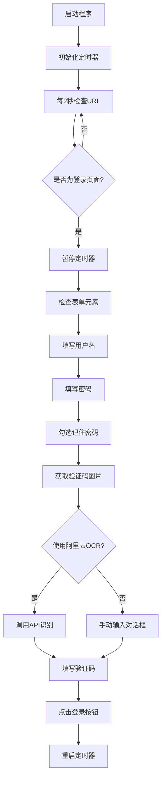

# B3B自动登录功能说明

## 🎯 功能概述

本功能为B3B机票交易平台提供自动登录能力，当WebView2控件检测到登录页面时，会自动填写用户名、密码，并尝试识别验证码完成登录。

## 🔧 核心功能

### 1. 自动页面检测
- 每2秒检查一次当前页面URL
- 当检测到包含"Login.aspx"的URL时自动触发登录流程

### 2. 自动表单填写
- **用户名**: 自动填写 `18988486220`
- **密码**: 自动填写 `zg123456`
- **记住密码**: 自动勾选复选框

### 3. 验证码识别
支持两种验证码识别方式：

#### 方式一：阿里云百炼大模型API（推荐）
- 使用qwen-vl-plus模型进行图像识别
- 准确率高，无需人工干预
- 需要配置有效的API Key

#### 方式二：手动输入（备选）
- 当API未配置或识别失败时启用
- 弹出对话框显示验证码图片
- 用户手动输入验证码

## 📁 文件结构

```
├── B3BForm.cs              # 主窗体，包含自动登录逻辑
├── CaptchaInputForm.cs     # 验证码手动输入对话框
├── Config.cs               # 配置管理类
├── config.json             # 配置文件（运行时自动生成）
├── TestAutoLogin.py        # 测试脚本
└── AutoLogin_README.md     # 本说明文档
```

## ⚙️ 配置说明

### config.json 配置文件
```json
{
  "AliCloudApiKey": "YOUR_API_KEY",
  "AliCloudApiUrl": "https://dashscope.aliyuncs.com/api/v1/services/aigc/multimodal-generation/generation",
  "AliCloudModel": "qwen-vl-plus",
  "EnableAutoLogin": true,
  "LoginUsername": "18988486220",
  "LoginPassword": "zg123456",
  "UseAliCloudOCR": true
}
```

### 配置项说明
- `AliCloudApiKey`: 阿里云百炼API密钥
- `AliCloudApiUrl`: API调用地址
- `AliCloudModel`: 使用的模型名称
- `EnableAutoLogin`: 是否启用自动登录
- `LoginUsername`: 登录用户名
- `LoginPassword`: 登录密码
- `UseAliCloudOCR`: 是否使用阿里云OCR

## 🚀 使用方法

### 1. 基本使用
1. 运行程序后，配置文件会自动生成
2. 点击"打开B3B"按钮
3. 程序会自动导航到B3B网站
4. 如果跳转到登录页面，会自动开始登录流程

### 2. 配置阿里云API（可选）
1. 打开 `config.json` 文件
2. 将 `AliCloudApiKey` 替换为您的实际API Key
3. 保存文件并重新运行程序

### 3. 手动触发登录（调试用）
```csharp
// 在代码中调用
await b3bForm.TriggerAutoLoginAsync();
```

## 🔍 测试方法

### 使用Python测试脚本
```bash
python TestAutoLogin.py
```

### 手动测试步骤
1. 运行程序
2. 点击"打开B3B"按钮
3. 观察控制台调试输出
4. 检查自动登录各个步骤是否正常执行

## 🛠️ 技术实现

### 自动登录流程


### 核心方法说明
- `LoginCheckTimer_Tick`: 定时检查登录页面
- `PerformAutoLoginAsync`: 执行自动登录流程
- `FillInputFieldAsync`: 填写表单字段
- `GetCaptchaTextAsync`: 获取验证码文本
- `CallAliCloudOCRAsync`: 调用阿里云API识别验证码

## 🔧 故障排除

### 常见问题

1. **自动登录不触发**
   - 检查URL是否包含"Login.aspx"
   - 确认`EnableAutoLogin`配置为true
   - 查看调试输出是否有错误信息

2. **验证码识别失败**
   - 检查API Key是否正确配置
   - 确认网络连接正常
   - 尝试手动输入模式

3. **表单填写失败**
   - 确认页面元素ID未发生变化
   - 检查JavaScript执行权限
   - 查看浏览器控制台错误

### 调试技巧
- 启用Visual Studio的调试输出窗口
- 检查临时文件夹中的验证码图片
- 使用浏览器开发者工具检查页面元素

## 📋 更新日志

### v1.0.0
- ✅ 基本自动登录功能
- ✅ 阿里云百炼API集成
- ✅ 手动验证码输入备选方案
- ✅ 配置文件管理
- ✅ 测试脚本和文档

## 🤝 贡献说明

如需改进此功能，请：
1. 遵循现有代码风格
2. 添加适当的错误处理
3. 更新相关文档
4. 测试所有功能分支

## 📞 技术支持

如遇到问题，请检查：
1. 网络连接状态
2. API配置是否正确
3. 目标网站是否有结构变化
4. 浏览器兼容性问题 